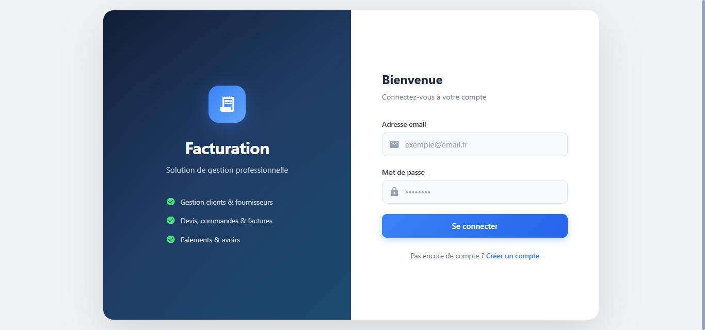
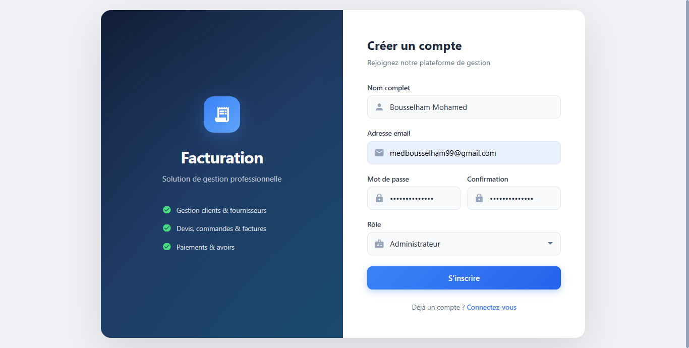
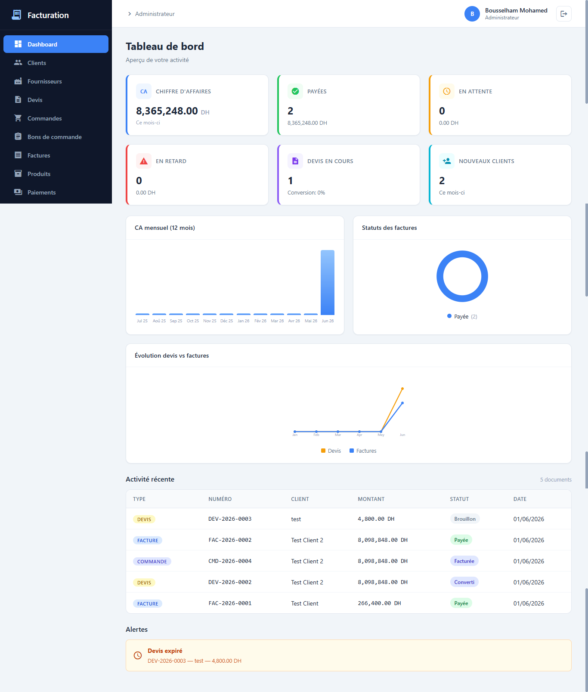
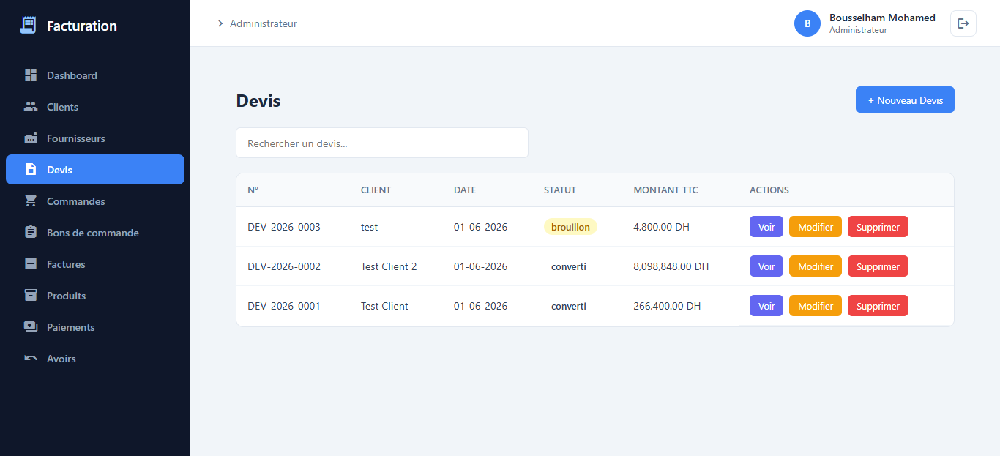
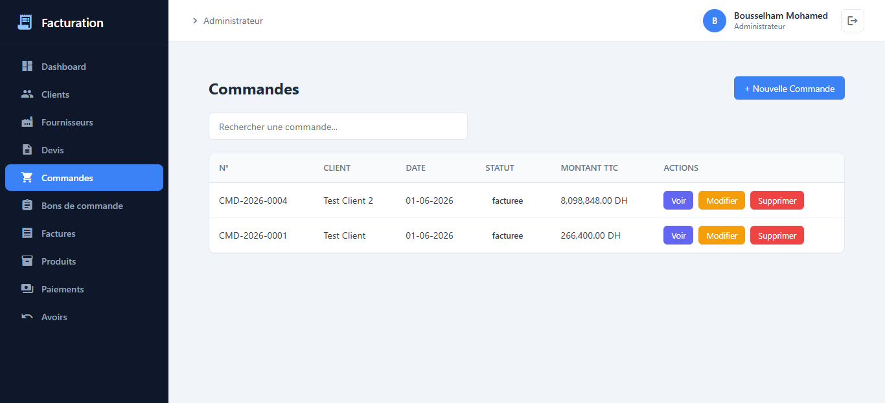
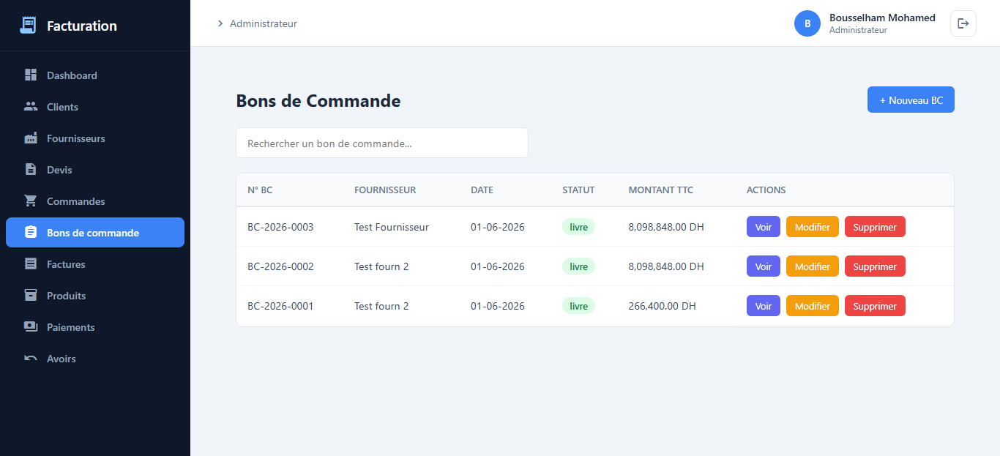
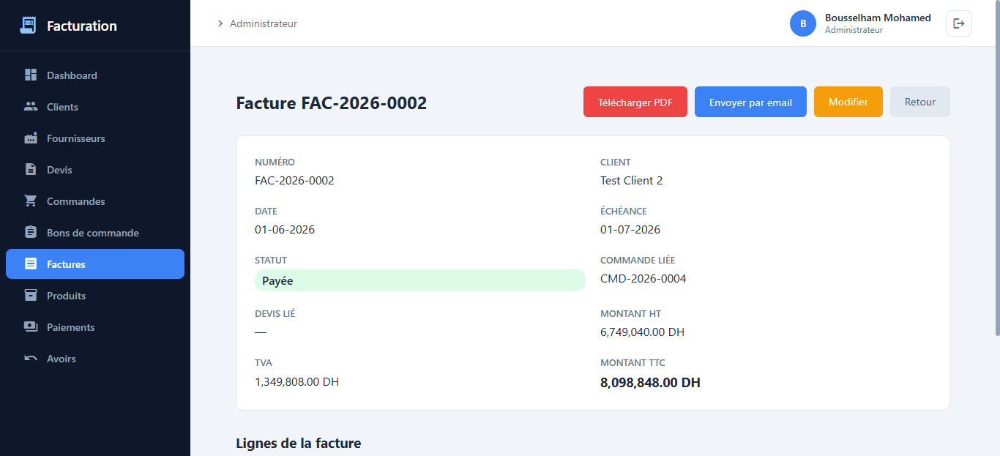

# Facturation — Système de Gestion de Facturation

Application web complète de gestion de facturation destinée aux PME et startups marocaines. Permet de gérer devis, commandes, bons de commande, factures, avoirs, paiements, produits, clients et fournisseurs.

## Tech Stack

| Couche | Technologie |
|--------|-------------|
| **Frontend** | Angular 18.2 |
| **Backend** | Laravel 12, SQLite |

## Fonctionnalités

- **Cycle commercial complet** : Devis → Commande → Bon de commande → Facture → Paiement
- **Conversion automatique** entre les documents (devis → commande → facture)
- **Dashboard** : KPIs, CA mensuel, évolution, alertes, activité récente
- **Rapports** : Ventes, TVA, Top clients (filtres période)
- **Produits & Services** : Catalogue avec auto-complétion dans les formulaires
- **Génération PDF** : Devis et factures au format professionnel
- **Envoi email** : Devis et factures directement depuis l'interface
- **Timeline** : Historique visuel de chaque document
- **Pagination** : 10 éléments par page
- **Authentification** : Sanctum token, rôles admin/backoffice
- **Paramètres entreprise** : Société, finances, email

## Démarrer le projet

### 1. Backend (Laravel API)

```bash
cd facturation-api
cp .env.example .env
composer install
php artisan key:generate
php artisan migrate --seed
php artisan serve
```

L'API tourne sur `http://127.0.0.1:8000`

### 2. Frontend (Angular)

```bash
cd facturation-front
npm install
ng serve --proxy-config proxy.conf.json
```

Le frontend tourne sur `http://localhost:4200`

### Identifiants de test

- **Email** : `test@example.com`
- **Mot de passe** : `password`

## Captures d'écran

| | |
|---|---|
| **Page de connexion** | **Page d'inscription** |
|  |  |
| **Tableau de bord** | **Page de devis** |
|  |  |
| **Page de commandes** | **Bons de commande** |
|  |  |
| **Détail facture** |
|  | |

